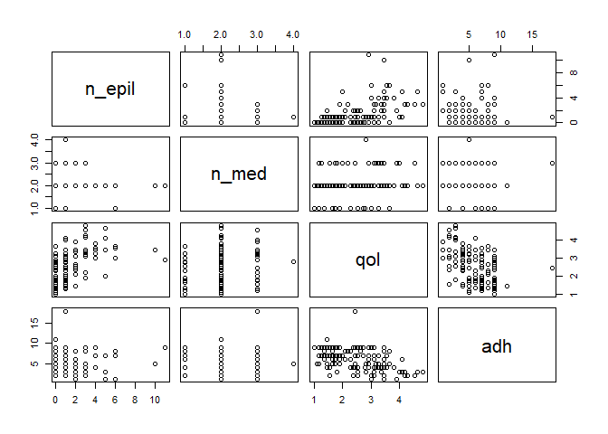
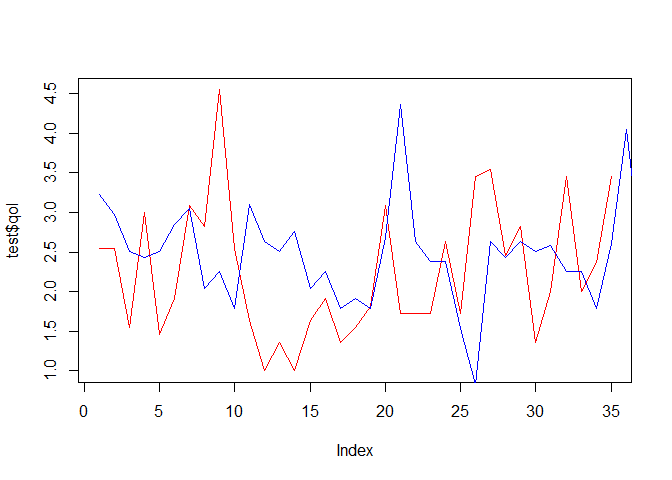

Supervised MachineLearning.
================
Joshua Edefo
2024-01-22

Library

``` r
library(caTools)
```

    ## Warning: package 'caTools' was built under R version 4.3.2

Import data

``` r
# import data and check the data, 
ep <- read.csv("C:/Users/joe62/OneDrive - Aberystwyth University/Apps/Desktop/R code/ep.csv")
head(ep)
```

    ##   n_epil n_med      qol adh
    ## 1      2     3 3.909091   1
    ## 2      2     2 3.363636   3
    ## 3      1     1 2.545455   2
    ## 4      1     2 1.909091   5
    ## 5      0     2 2.454545   4
    ## 6      1     2 1.636364   5

``` r
str(ep)
```

    ## 'data.frame':    141 obs. of  4 variables:
    ##  $ n_epil: int  2 2 1 1 0 1 0 2 3 0 ...
    ##  $ n_med : int  3 2 1 2 2 2 2 2 3 2 ...
    ##  $ qol   : num  3.91 3.36 2.55 1.91 2.45 ...
    ##  $ adh   : int  1 3 2 5 4 5 3 4 4 7 ...

``` r
summary(ep)
```

    ##      n_epil           n_med            qol             adh        
    ##  Min.   : 0.000   Min.   :1.000   Min.   :1.000   Min.   : 1.000  
    ##  1st Qu.: 0.000   1st Qu.:2.000   1st Qu.:1.636   1st Qu.: 4.000  
    ##  Median : 1.000   Median :2.000   Median :2.455   Median : 6.000  
    ##  Mean   : 1.312   Mean   :2.085   Mean   :2.420   Mean   : 5.922  
    ##  3rd Qu.: 2.000   3rd Qu.:2.000   3rd Qu.:3.091   3rd Qu.: 8.000  
    ##  Max.   :11.000   Max.   :4.000   Max.   :4.818   Max.   :18.000

``` r
plot(ep)
```

<!-- -->

Getting the best regression model

``` r
# set seed
set.seed(12)

# cheak for multicolinearity , and correlation of indepedent variables with dependent variable
cor(ep, method="pearson")
```

    ##             n_epil       n_med        qol         adh
    ## n_epil  1.00000000  0.06524041  0.5292356 -0.19102031
    ## n_med   0.06524041  1.00000000  0.1273141 -0.05600179
    ## qol     0.52923555  0.12731410  1.0000000 -0.47056220
    ## adh    -0.19102031 -0.05600179 -0.4705622  1.00000000

``` r
# no multicolineraity
# correlaion between qol and n_med is weak so drop n_med
# best model will be qol~n_epil+ adh that the model excluding the n_med variable
```

Splitting the dataset

``` r
split <- sample.split( ep, SplitRatio= 0.8)
#80% training set and 20% testing set

train<- subset(ep, split == "TRUE")
train
```

    ##     n_epil n_med      qol adh
    ## 1        2     3 3.909091   1
    ## 2        2     2 3.363636   3
    ## 4        1     2 1.909091   5
    ## 5        0     2 2.454545   4
    ## 6        1     2 1.636364   5
    ## 8        2     2 2.363636   4
    ## 9        3     3 3.454545   4
    ## 10       0     2 1.909091   7
    ## 12       1     2 1.818182   7
    ## 13       0     2 1.363636   9
    ## 14       2     3 3.090909   2
    ## 16       1     3 2.454545   4
    ## 17       1     2 2.454545   5
    ## 18       1     3 4.000000   3
    ## 20       0     2 1.454545   7
    ## 21       1     3 1.545455   7
    ## 22       0     1 1.727273   9
    ## 24       0     2 1.636364   8
    ## 25       0     2 3.090909   9
    ## 26       0     2 2.363636   2
    ## 28      10     2 3.454545   5
    ## 29       1     2 3.090909   4
    ## 30       1     2 4.090909   6
    ## 32       1     3 3.090909   6
    ## 33       0     2 1.454545  11
    ## 34       1     3 2.454545  18
    ## 36       1     2 3.090909   4
    ## 37       0     1 3.272727   4
    ## 38       1     2 1.545455   4
    ## 40       1     3 3.272727   5
    ## 41       2     2 2.090909   6
    ## 42       1     2 2.545455   7
    ## 44       1     2 1.272727   7
    ## 45       0     2 1.545455   9
    ## 46       4     2 3.000000   9
    ## 48       6     2 3.000000   1
    ## 49       0     2 2.272727   4
    ## 50       0     2 1.454545   5
    ## 52       0     2 1.272727   7
    ## 53       1     1 2.727273   7
    ## 54       0     1 1.000000   9
    ## 56       3     2 4.272727   2
    ## 57       3     2 4.181818   3
    ## 58       1     2 2.545455   2
    ## 60       1     2 2.909091   6
    ## 61       1     2 1.909091   7
    ## 62       6     2 3.545455   7
    ## 64       0     2 2.454545   9
    ## 65       0     2 1.272727   9
    ## 66       0     1 2.272727   8
    ## 68       1     2 2.090909   8
    ## 69       0     1 2.545455   9
    ## 70       1     2 1.818182   9
    ## 72       1     2 3.454545   2
    ## 73       2     2 2.545455   3
    ## 74       5     2 3.454545   1
    ## 76       3     3 3.181818   4
    ## 77       0     2 3.272727   5
    ## 78       5     2 4.090909   3
    ## 80       0     2 1.454545   4
    ## 81       0     2 2.454545   4
    ## 82       0     3 1.727273   7
    ## 84       0     3 1.181818   7
    ## 85       3     3 3.181818   5
    ## 86       5     2 2.000000   7
    ## 88       0     2 3.636364   5
    ## 89       0     1 1.636364   6
    ## 90       0     3 2.454545   7
    ## 92       1     2 1.454545   9
    ## 93       0     3 1.272727   9
    ## 94       0     2 2.727273   9
    ## 96       1     2 3.090909   7
    ## 97       2     2 2.636364   8
    ## 98       0     1 1.181818   9
    ## 100      3     2 4.181818   2
    ## 101      0     2 1.545455   2
    ## 102      0     2 2.909091   4
    ## 104      2     2 1.454545   5
    ## 105      3     2 4.818182   3
    ## 106      5     2 4.636364   3
    ## 108      0     1 2.800000   4
    ## 109      1     2 2.818182   3
    ## 110      1     2 1.636364   5
    ## 112      0     2 1.090909   5
    ## 113      1     3 2.909091   5
    ## 114      1     2 2.454545   4
    ## 116      0     2 1.181818   5
    ## 117      1     2 2.272727   4
    ## 118      3     3 3.363636   4
    ## 120      1     2 1.727273   7
    ## 121      1     2 1.363636   7
    ## 122      0     3 2.454545   7
    ## 124      1     2 2.272727   6
    ## 125      4     2 3.818182   4
    ## 126      4     2 3.272727   7
    ## 128      0     2 2.909091   7
    ## 129      0     2 1.363636   7
    ## 130      0     2 1.636364   7
    ## 132      0     2 1.818182   9
    ## 133      3     3 2.181818   8
    ## 134     11     2 2.909091   9
    ## 136      1     2 1.909091   9
    ## 137      0     2 1.636364   9
    ## 138      0     2 1.000000   9
    ## 140      6     1 3.636364   8
    ## 141      4     2 3.454545   9

``` r
str(train)
```

    ## 'data.frame':    106 obs. of  4 variables:
    ##  $ n_epil: int  2 2 1 0 1 2 3 0 1 0 ...
    ##  $ n_med : int  3 2 2 2 2 2 3 2 2 2 ...
    ##  $ qol   : num  3.91 3.36 1.91 2.45 1.64 ...
    ##  $ adh   : int  1 3 5 4 5 4 4 7 7 9 ...

``` r
test <- subset(ep, split== "FALSE")
test
```

    ##     n_epil n_med      qol adh
    ## 3        1     1 2.545455   2
    ## 7        0     2 2.545455   3
    ## 11       1     2 1.545455   7
    ## 15       1     1 3.000000   2
    ## 19       0     2 1.454545   7
    ## 23       0     1 1.909091   6
    ## 27       1     2 3.090909   3
    ## 31       1     4 2.818182   5
    ## 35       3     3 4.545455   2
    ## 39       0     1 2.545455   4
    ## 43       0     2 1.636364   7
    ## 47       0     2 1.000000   9
    ## 51       1     2 1.363636   6
    ## 55       0     2 1.000000   9
    ## 59       1     2 1.636364   5
    ## 63       3     2 1.909091   9
    ## 67       1     1 1.363636   8
    ## 71       1     2 1.545455   7
    ## 75       0     3 1.818182   3
    ## 79       3     2 3.090909   4
    ## 83       1     3 1.727273   5
    ## 87       0     2 1.727273   7
    ## 91       0     2 1.727273   6
    ## 95       0     2 2.636364   9
    ## 99       0     3 1.727273   9
    ## 103      2     2 3.454545   4
    ## 107      4     2 3.545455   4
    ## 111      2     2 2.454545   4
    ## 115      1     2 2.818182   5
    ## 119      0     2 1.363636   7
    ## 123      0     2 2.000000   7
    ## 127      2     3 3.454545   6
    ## 131      1     3 2.000000   7
    ## 135      0     2 2.363636   9
    ## 139      2     2 3.454545   8

``` r
str(test)
```

    ## 'data.frame':    35 obs. of  4 variables:
    ##  $ n_epil: int  1 0 1 1 0 0 1 1 3 0 ...
    ##  $ n_med : int  1 2 2 1 2 1 2 4 3 1 ...
    ##  $ qol   : num  2.55 2.55 1.55 3 1.45 ...
    ##  $ adh   : int  2 3 7 2 7 6 3 5 2 4 ...

Create and use the best Regression model

``` r
# Best R model 
R_best_model <- lm(qol~n_epil+ adh, data= train)
summary(R_best_model)
```

    ## 
    ## Call:
    ## lm(formula = qol ~ n_epil + adh, data = train)
    ## 
    ## Residuals:
    ##      Min       1Q   Median       3Q      Max 
    ## -1.25831 -0.52016 -0.06658  0.47817  1.71242 
    ## 
    ## Coefficients:
    ##             Estimate Std. Error t value Pr(>|t|)    
    ## (Intercept)  2.94626    0.18884  15.602  < 2e-16 ***
    ## n_epil       0.20549    0.03546   5.795 7.52e-08 ***
    ## adh         -0.12888    0.02679  -4.811 5.15e-06 ***
    ## ---
    ## Signif. codes:  0 '***' 0.001 '**' 0.01 '*' 0.05 '.' 0.1 ' ' 1
    ## 
    ## Residual standard error: 0.7169 on 103 degrees of freedom
    ## Multiple R-squared:  0.4005, Adjusted R-squared:  0.3889 
    ## F-statistic: 34.41 on 2 and 103 DF,  p-value: 3.585e-12

Using the model as a predictive tool

``` r
predict<-predict(R_best_model, data=test)
```

Validating the model

``` r
#comparing prdicteed versus actual values
plot(test$qol, type='l', lty = 1.8, col= 'red',)
lines(predict, type='l', lty = 1.8, col= 'blue')
```

<!-- -->

``` r
#finding accuracy

rmse<-sqrt(mean(train$qol-predict)^2)
```

Session information

``` r
sessionInfo()
```

    ## R version 4.3.1 (2023-06-16 ucrt)
    ## Platform: x86_64-w64-mingw32/x64 (64-bit)
    ## Running under: Windows 11 x64 (build 22631)
    ## 
    ## Matrix products: default
    ## 
    ## 
    ## locale:
    ## [1] LC_COLLATE=English_United Kingdom.utf8 
    ## [2] LC_CTYPE=English_United Kingdom.utf8   
    ## [3] LC_MONETARY=English_United Kingdom.utf8
    ## [4] LC_NUMERIC=C                           
    ## [5] LC_TIME=English_United Kingdom.utf8    
    ## 
    ## time zone: Europe/London
    ## tzcode source: internal
    ## 
    ## attached base packages:
    ## [1] stats     graphics  grDevices utils     datasets  methods   base     
    ## 
    ## other attached packages:
    ## [1] caTools_1.18.2
    ## 
    ## loaded via a namespace (and not attached):
    ##  [1] compiler_4.3.1    fastmap_1.1.1     cli_3.6.1         tools_4.3.1      
    ##  [5] htmltools_0.5.6   rstudioapi_0.15.0 yaml_2.3.7        rmarkdown_2.25   
    ##  [9] knitr_1.44        xfun_0.40         digest_0.6.33     bitops_1.0-7     
    ## [13] rlang_1.1.1       evaluate_0.21
